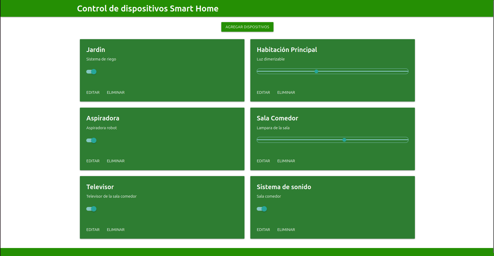
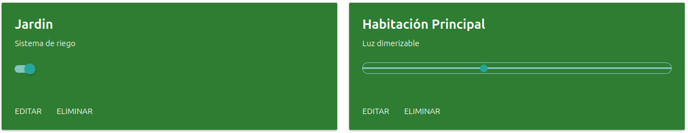
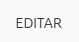
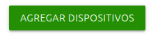

# Trabajo Final Desarrollo de Aplicaciones WEB

#### Autor:

* Alejandro Santa Calderón

#### Docentes:

* Matias Ramos

## Índice de contenidos

1. [Introducción](#introducción)
2. [Instalación de dependencias](#instalación-de-dependencias)
    2.1. [Docker](#Docker)
    2.1.1. [Agregar repositorios de Docker](#Agregar-repositorios-de-Docker)
    2.1.2. [Instalar Docker Engine](#Instalar-Docker-Engine)
    2.1.3. [Verificar la instalación](#Verificar-la-instalación)
    2.2. [Docker Compose](#Docker-Compose)
    2.2.1. [Descargar el archivo](#Descargar-el-archivo)
    2.2.2. [Asignar permisos de ejecución](#Asignar-permisos-de-ejecución)
    2.2.3. [Verificar la instalación](#Verificar-la-instalación)
    2.2.4. [Imágenes de Docker](#Imágenes-de-Docker)
3. [Implementación](#implementación)
    3.1. [Introducción específica](#Introducción-específica)
    3.2. [Principio de funcionamiento](#Principio-de-funcionamiento)
    3.3. [Estructura del proyecto](#Estructura-del-proyecto)
    3.4. [Estructura del proyecto](#Estructura-del-proyecto)
    3.5. [Frontend](#Frontend)
    3.5.1. [Soporte de rangos](#Soporte-de-rangos)
    3.5.2. [Edición de dispositivos](#Edición-de-dispositivos)
    3.5.3. [Adición de dispositivos](#Adición-de-dispositivos)
    3.5.4. [Eliminación de dispositivos](#Eliminación-de-dispositivos)
    3.6. [Backend](#Backend)
    3.6.1. [Adición, edición y borrado de información](#Adición-,-edición-y-borrado-de-información)
    3.6.2 [Base de datos](#Base-de-datos)
4. [Ejecución de la aplicación](#ejecución-de-la-aplicación)
5. [Licencia](#licencia)

## Introducción.

El **TP final para Desarrollo Aplicaciones Web** esta basado en el desarrollo de un aplicativo web para control de dispositivos en un Smart Home. Este proyecto se desarrolla utilizando los conceptos aportados por la materia para incorporar nuevas funciones al trabajo aportado por el profesor Matias Ramos ["template"](https://github.com/mramos88/app-fullstack-base-2024-i10).

## Instalación de dependencias.

El proyecto fue desarrollado sobre un contenedor Docker. A continuación se daran los pasos para instalar las herramientas necesarias para el funcionamiento. Este procedimiento se lleva a cabo utilizando Linux Ubuntu 24.04

### Docker.

Por definicion es una plataforma de software de código abierto que te permite crear, desplegar y gestionar aplicaciones dentro de contenedores. Imagina estos contenedores como pequeños paquetes autónomos que contienen todo lo necesario para que una aplicación funcione correctamente: el código, las bibliotecas, las herramientas y las configuraciones.

### Agregar el repositorio de Docker:

Para instalar Docker, es necesario agregar el repositorio oficial de Docker a la lista de fuentes de software de tu sistema. Esto permitirá que tu sistema sepa dónde encontrar los paquetes de Docker.

    sudo apt install -y ca-certificates curl gnupg lsb-release
    sudo mkdir -p /etc/apt/keyrings
    curl -fsSL https://download.docker.com/linux/ubuntu/gpg | sudo gpg --dearmor -o /etc/apt/keyrings/docker.gpg
    sudo sh -c 'echo "deb [signed-by=/etc/apt/keyrings/docker.gpg] https://download.docker.com/linux/ubuntu $(lsb_release -cs) stable" > /etc/apt/sources.list.d/docker.list'

>**Nota:** Los comandos para agregar el repositorio pueden variar ligeramente según la distribución. 

### Instalar Docker Engine.

Una vez que el repositorio esté configurado, puedes instalar Docker Engine.
Instaladas las dependencias de Docker, se debe agregar la clave.

     sudo apt update
     sudo apt install docker-ce docker-ce-cli containerd.io
  
### Verificar la instalación.
Para comprobar si Docker se ha instalado correctamente, ejecuta el siguiente comando:

    sudo docker run hello-world
  
Si la instalación fue exitosa, deberá aparecer en la consola el siguiente mensaje:

    Unable to find image 'hello-world:latest' locally 
    latest: Pulling from library/hello-world 
    Hello from Docker! 
    ... 
    To try something more ambitious, you can run an Ubuntu container with: $ docker run -it ubuntu bash

## Docker Compose

Se trata de una herramienta que facilita enormemente la gestión y el despliegue de aplicaciones que utilizan múltiples contenedores Docker.

A continuación se detalla el proceso de instalación de esta herramienta.

### Descargar el archivo: 

Utiliza el comando curl para descargar el archivo. 

    curl -L "https://github.com/docker/compose/releases/download/vX.XX.X/docker-compose-linux-x86_64" -o /usr/local/bin/docker-compose

>*Nota:* Reemplaza vX.XX.X por la versión más reciente disponible y ajusta la ruta de descarga según tus preferencias.

### Asignar permisos de ejecución. 

Para poder ejecutar el binario, otorga permisos de ejecución: 

    sudo chmod +x /usr/local/bin/docker-compose

### Verificar la instalación.

Ejecuta el siguiente comando para verificar que Docker Compose se haya instalado correctamente: 

    docker-compose --version

### Imágenes de Docker.

Para poder ejecutar el contenedor del Trabajo Final, se que quieren las herramientas del contenedor a través de sus imágenes.

Para instalarlas se utilizan los siguientes comandos:

    docker pull harmish/typescript
    docker pull mysql:5.7
    docker pull phpmyadmin/phpmyadmin
    docker pull abassi/nodejs-server:10.0-dev

## Implementación.

### Introducción específica.

La aplicación web **Control de dispositivos Smart Home** es un **frontend** que interactúa con un **backend Node.js**. Cuando un usuario accede a la aplicación a través de un navegador, se envían solicitudes **HTTP** al servidor **Node.js**. Este servidor procesa las solicitudes, gestiona la base de datos (si la hubiera) y devuelve una respuesta al navegador, que se renderiza en la interfaz de usuario. La imagen adjunta muestra la **interfaz gráfica de usuario (GUI)** de la aplicación.

El desarrollo **frontend** de la aplicación se basó en **TypeScript**, un lenguaje de programación que aporta tipado estático a **JavaScript**. El **framework Materialize**, siguiendo las pautas de diseño de **Material Design**, se empleó para la interfaz de usuario. En el **backend**, se utilizó la combinación de **Node.js** con **Express.js**, y una base de datos **MySQL** administrada con **phpMyAdmin**.

### Principio de funcionamiento

Al realizar una petición **GET** al servidor, se carga el archivo **index.html** que actúa como punto de entrada de la aplicación. El **JavaScript** principal, **Main.js**, junto con **MyFramework.js** y **ViewMainPage.js**, se encargan de renderizar la interfaz de usuario de forma dinámica y de manejar las interacciones con el **backend**. **MyFramework.js** proporciona utilidades para cargar y gestionar el contenido de las tarjetas, mientras que **ViewMainPage.js** se encarga de la comunicación con el servidor para realizar operaciones **CRUD**.

Para este proyecto se enriqueció el modelo de datos con atributos como el tipo de dispositivo **(conmutador, dimmer, etc.)**, el rango de regulación **(para dimmers)** y las acciones soportadas **(ON, OFF)**. La estructura detallada de esta información se describe en la sección [Base de datos](#base-de-datos).

### Estructura del proyecto

El proyecto está estructurado de la siguiente manera:

    ├── db                          # Base de datos (BD).
    │   ├── data                    # Estructura y datos de la BD.
    │   └── dumps                   # Directorio de estructuras de la BD.
    │       └── smart_home.sql      # Estructura con la BD "smart_home".
    ├── doc                         # Documentación general del proyecto.
    └── src                         # Directorio del código fuente.
    │   ├── back                    # Directorio para el backend de la aplicación
    │   │   ├── index.js            # Código principal del backend.
    │   │   ├── mysql-connector.js  # Código de conexion a la BD.
    │   │   ├── package.json        # Configuración de proyecto NodeJS.
    │   │   └── package-lock.json   # Configuración de proyecto NodeJS.
    │   └── front                   # Directorio para el frontend de la aplicacion
    │       ├── index.html          # Archivo principal del cliente HTML.
    │       ├── js                  # Código JavaScript compilado.
    │       ├── static              # Archivos estáticos (imágenes, CSS, fuentes).
    │       └── ts                  # Código TypeScript a compilar.
    ├── docker-compose.yml          # Archivo de configuracion del contenedor.
    ├── README.md                   # Archivo actual.
    ├── CHANGELOG.md                # Archivo para guardar cambios.
    ├── LICENSE.md                  # Archivo de licencia.

### Frontend.

Conforme a los requerimientos del Trabajo Final, se desarrollaron las siguientes funcionalidades en la interfaz de usuario.

#### Soporte de rangos.

El proyecto final contempló la necesidad de ampliar las opciones de control de dispositivos, permitiendo la configuración de valores continuos en aquellos casos donde el estado no se limita a un valor binario (encendido/apagado). Para ello, se incorporó un nuevo tipo de actuador, el 'slider', que complementa a los tradicionales 'switch'. Esta nueva funcionalidad se ilustra en la siguiente imagen.

#### Edición de dispositivos.

Se planteó la implementación de una funcionalidad que permitiera modificar los atributos de los dispositivos registrados, tales como nombre, descripción y tipo. Para facilitar esta acción, se incorporó un botón de edición en cada dispositivo, como se ilustra en la imagen adjunta.

Haciendo click en el botón indicado, se invoca una ventana modal que exhibe los datos del dispositivo en cuestión, permitiendo su actualización. La figura adjunta muestra la ventana modal mencionada.

#### Adición de dispositivos.

La consigna proponía adaptar el "frontend" para permitir la adición de nuevos dispositivos. Para ello, se dispuso un botón destinado para tal fin.

Al hacer click en el mismo, se despliega un "modal" que permite ingresar todos los datos necesarios para agregar un nuevo dispositivo en la aplicación.

#### Eliminación de dispositivos.

Se habilitó la posibilidad de dar de baja dispositivos desde la aplicación. Para ello, se añadió un control de eliminación en la interfaz de usuario de cada dispositivo, tal y como se observa en la imagen adjunta.

La implementación subyacente de estas funcionalidades se sustenta en la vinculación del evento 'click' a todos los elementos HTML utilizando el método 'addEventListener'. La lógica de procesamiento se determina de forma dinámica en función del valor del atributo 'id' de cada elemento dentro de la función 'handleEvent'.

Haciendo clic en el botón indicado, se invoca una ventana modal que advierte al usuario acerca de las consecuencias de eliminar el dispositivo y solicita su autorización para llevar a cabo dicha operación.

## Backend.

Complementando la implementación existente, se estableció la necesidad de enriquecer el conjunto de recursos expuestos por la API, incorporando nuevas funcionalidades que requirieron el desarrollo de endpoints HTTP personalizados.

### Adición, edición y borrado de información.

El protocolo de comunicación entre el cliente y el servidor se basa en el intercambio de objetos JSON. El análisis del payload de las solicitudes HTTP POST permite determinar dinámicamente la operación a realizar sobre la base de datos, seleccionando la consulta SQL adecuada en función de los atributos presentes en el objeto JSON.

Para el borrado de información, se especificó el requerimiento de implementar una operación de eliminación de recursos. Para ello, se definió un recurso HTTP que admite el método DELETE.

### Base de datos.

La aplicación emplea una base de datos MySQL denominada 'smart_home'. Para dar soporte a las nuevas funcionalidades, se realizaron modificaciones a la tabla 'Devices'. Esta tabla almacena información detallada de cada dispositivo, incluyendo un campo 'type' que determina si el dispositivo es binario (0) o de rango variable (1). El estado de los dispositivos binarios se representa mediante el campo 'state', mientras que el estado de los dispositivos de rango variable se representa mediante el campo 'percent'.

## Ejecución de la aplicación.

Una vez que se han instaladas todas las dependencias se podrá ejecutar la aplicación. Para ello, se deberá descargar éste repositorio.

    git clone https://github.com/alejosantac34/app-fullstack-base-2024-i10-CEIoT-ASANTA

Para inicializar el contenedor, primero se debe acceder al directorio donde se descargó el repositorio.

    cd app-fullstack-base-2024-i10-CEIoT-ASANTA

Y ejecutar el siguiente comando.

    docker-compose up

Una vez iniciado, simplemente resta abrir una nueva pestaña en el navegador a elección y acceder a la dirección ``http://localhost:8000/``.

Para cerrar el contenedor, se puede correr el comando ``docker-compose down`` desde otra terminal o bien cerrar la pestaña del navegador y utilizar el shortcut ``Ctrl+C``, obteniendo el mismo resultado.

> **NOTA**: La primera vez que se ejecuta el comando ``docker-compose up`` casi seguro que la base de datos MySQL arrojará un error y en la aplicación no aparecerá ningún dispositivo, es decir, solo se mostrará el "cascarón". Si eso sucede, será necesario reiniciar el contenedor. Para ello, cerrarlo con ``docker-compose down`` y volver a iniciarlo con ``docker-compose up``.

## Licencia

licencia GPLv3. [este enlace](https://www.gnu.org/licenses/quick-guide-gplv3.html)

